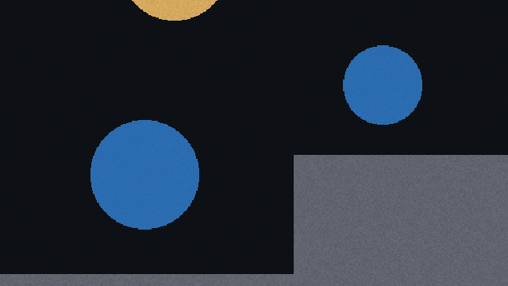
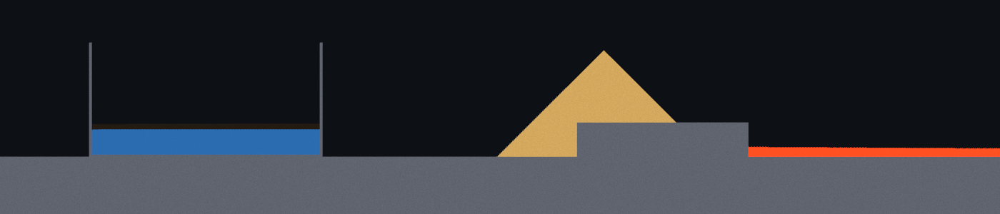
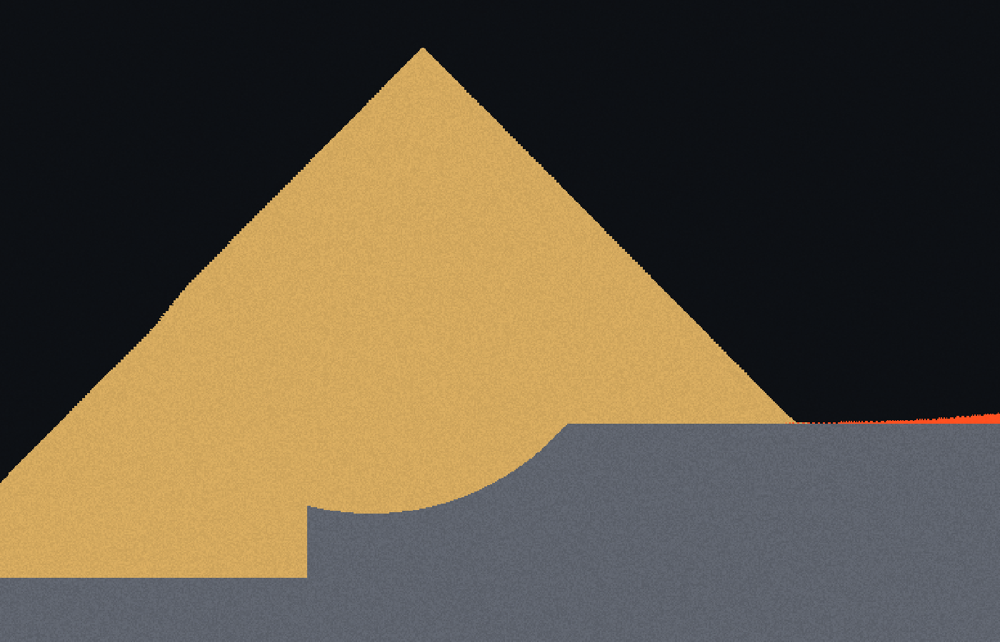
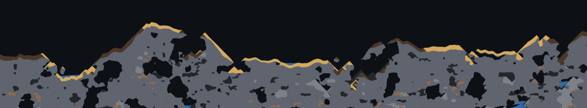

# swarf



A granular-material sandbox: every pixel is a cell of real material with a
density, falling, flowing and piling under its own rules. 4096x2048 cells,
simulated entirely on the GPU at 240 Hz.

Rust + wgpu, 2D. Written and measured on Apple Silicon (Metal).







## Why it exists

It is the substrate for a factory game where machines crush, melt and cast
actual material. That only works if the physics conserves mass exactly, and the
usual falling-sand rule ("move into the cell below if it's empty") loses that the
moment two grains want the same destination. This one is built so that
collision cannot happen.

## How it works

The world is 4096x2048 cells. One cell is one `u32` (material id, a colour
variant, and a temperature in Kelvin), so the whole world is 32 MB and lives in
a single storage buffer.

**The simulation is a Margolus block cellular automaton.** The grid is carved
into 2x2 blocks and one GPU thread owns one block outright: it reads its four
cells, permutes them, and writes those same four back. Nothing else touches
them. This buys three things:

- **No write conflicts**, so no atomics and no arbitration pass. Two grains can
  never both claim one destination, because destinations never span two threads.
- **Exact mass conservation.** Cells are permuted, never created or destroyed.
- **A uniform GPU workload**, every thread doing identical work.

The cost is that a block only sees itself, so material moves at most one cell
per tick. The partition origin shifts every tick to hide the seam; the y
component *must* flip every tick, or everything falls at half speed: a cell can
only fall when it sits in the top row of its block, so a y that holds still for
two ticks strands it in a bottom row for one of them.

Because one cell per tick is the hard ceiling on every transport rate, the
simulation runs at **240 Hz**, decoupled from the display. A 120 Hz screen
renders twice per tick rather than simulating twice as fast.

**Chunk sleeping is what makes that affordable.** A 32x32 chunk whose contents
have stopped moving is not dispatched at all, and almost all of a mature world
is settled at any moment. A chunk that moves anything wakes itself and its eight
neighbours for the next four ticks: its neighbours because a 2x2 block straddles
the chunk edge on odd partition phases, and four ticks because some moves are
only possible on one of the four phases. Measured on an M4, 4096x2048:

| | ms per tick |
|---|---|
| simulating everything | 0.72 |
| with chunk sleeping, settled | 0.11 |

Rendering is one fullscreen triangle whose fragment shader samples the cell
buffer directly, with no intermediate texture and no upload, because on unified
memory the buffer the compute pass just wrote is already where the fragment
shader reads. Zero copies per frame.

## Rules worth knowing

Movement is driven by density alone: denser sinks. Gases need no special case:
steam is lighter than air, so it "sinks" upward for free. Sand heaps at 45
degrees, the theoretical maximum for a 2x2 stencil.

Three details took real work to get right, and each is easy to get subtly wrong:

- **Water needs pressure from above *and* from behind.** Weight alone is not
  enough: the cells free to move sideways are exactly the ones with nothing on
  top of them, so water settles into a stable wedge and never levels. One cell
  of look-behind fixes it, and keeps isolated droplets from wandering the floor
  forever holding their chunk awake.
- **The pressure test has to include the diagonals.** Check only straight up and
  a heap of water is stable by exactly one cell: every surface cell has air
  directly above it, so the mound sits there as a dome. Its outermost cells do
  have fluid diagonally above, which is precisely the weight that ought to be
  pushing them out.
- **Mobility below 1.0.** With every cell trying to fall on the same tick, only
  the bottom of a falling mass can move, so a gap walks up it in lockstep and it
  descends as a barcode of alternating full and empty rows. The dilation is real;
  the regularity is not. A per-material chance of taking the gravity step breaks
  the lockstep, and doubles as a viscosity knob: lava oozes, water runs.

Neighbour reads inside the sim shader are racy on purpose: another workgroup may
be mid-write, so you get either the pre- or post-tick value. That is fine,
because those reads only ever feed a *decision* (is this cell under pressure?),
never a write. Worst case a drop of water spreads one tick early.

## Running it

```
cargo run --release
```

Needs a GPU that wgpu can reach. Developed against Metal on Apple Silicon; the
Vulkan and DX12 backends should work but are untested.

| | |
|---|---|
| LMB / RMB | paint / erase |
| MMB, or space + drag | pan |
| WASD or arrow keys | pan |
| scroll | zoom at cursor |
| `1`-`0` | material hotbar |
| `Q` / `E` | cycle all materials |
| `[` / `]` | brush size |
| `P` / `N` | pause / single step |
| `R` | regenerate world |
| `Esc` | quit |

## Developing

The physics is tuned by *looking* at it, so there is a headless renderer that
runs N ticks and writes a PNG (add `--every K` for a numbered frame every K
ticks; `docs/make-gif.sh` builds the GIF above that way):

```
cargo run --release -- --shot out.png --scene lab --ticks 6000 --zoom 1 \
    --centre 2100,1090 --drop sand@2100,850,60
```

`--scene lab` is a bare rig (flat floor, a step, a sealed vessel) because
terrain noise makes it impossible to tell a rule bug from a lumpy cave. A heap
should hold a stable angle; a vessel should end up level, though levelling is
diffusive and an 800-cell-wide vessel takes a few hundred thousand ticks. Output
is close to, but not bit-for-bit, repeatable: the racy neighbour reads above
mean two runs of the same seed differ in a few percent of grains. `--help` lists
the rest.

```
cargo test --release
```

runs three headless GPU tests against the `lab` scene: every material's cell
count is unchanged after 4000 ticks of mixing, water in a basin settles with
its surface within one cell, and a sand heap is nowhere steeper than 45 degrees.
They take about 30 s and need the same GPU access as `--shot`.

## Layout

```
shaders/common.wgsl   cell packing, material struct, hashing (prepended to the rest)
shaders/sim.wgsl      the block automaton and chunk sleeping
shaders/chunks.wgsl   advances wake state between ticks
shaders/paint.wgsl    brush strokes, stamped as swept capsules
shaders/render.wgsl   fullscreen triangle, palette, brush ring
src/materials.rs      the material table; behaviour is data, not code
src/world.rs          cell packing and terrain generation
src/sim.rs            buffers, compute pipelines, the tick
src/shot.rs           headless capture
src/tests.rs          headless physics tests
docs/make-gif.sh      rebuilds docs/img/pour.gif
```

Adding a material is a row in `MATERIALS`. Nothing in the shaders knows any
material by name.

## Status

The material layer works and is the whole of what exists. Sixteen materials,
terrain generation, painting, chunk sleeping, headless capture and the physics
tests all run end to end on an M4 Mac. What it does not do yet:

- **Temperature is stored but inert.** Every cell carries 16 bits of Kelvin and
  lava is painted at 1500 K, but nothing reads it. No heat transfer, no melting,
  no phase change: molten iron and lava are currently just dense fluids with an
  emissive colour.
- **No machines.** None of the factory-game part is built; this is the substrate
  it would sit on.
- Fixed world size, no save/load, and no way to add a material without a
  recompile.

## License

MIT. See [LICENSE](LICENSE).
